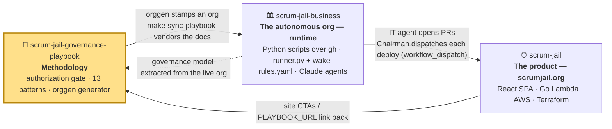
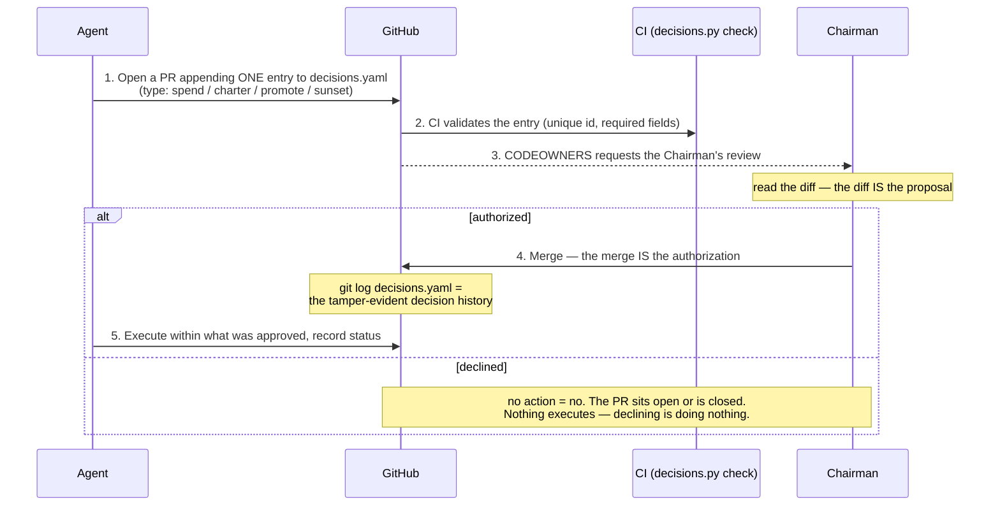
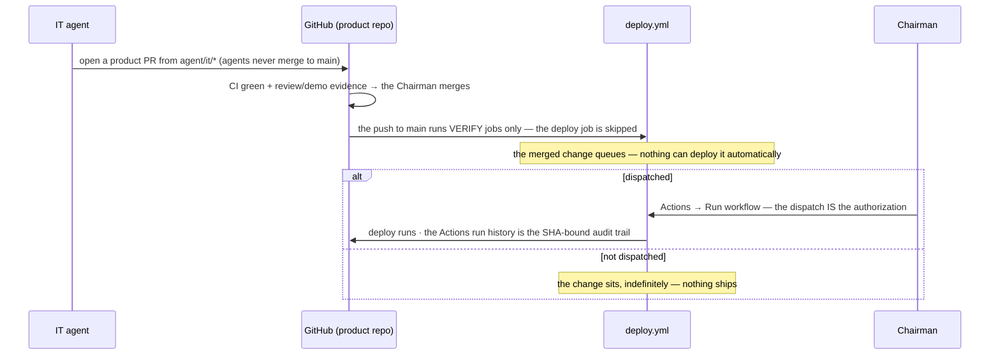
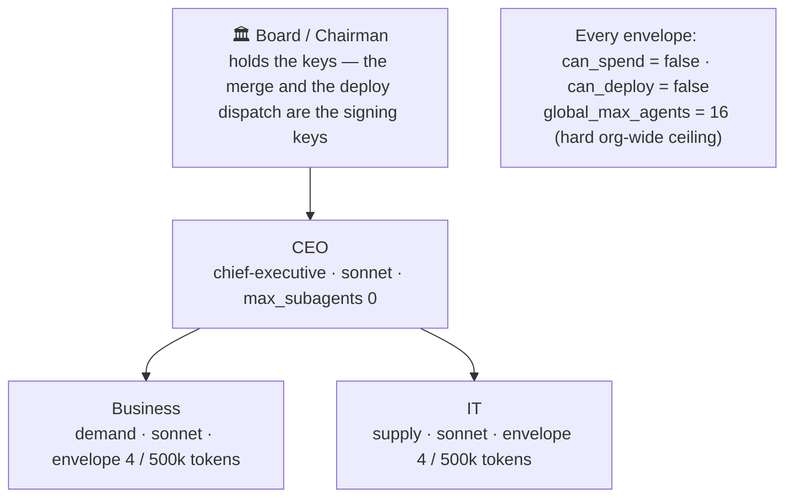
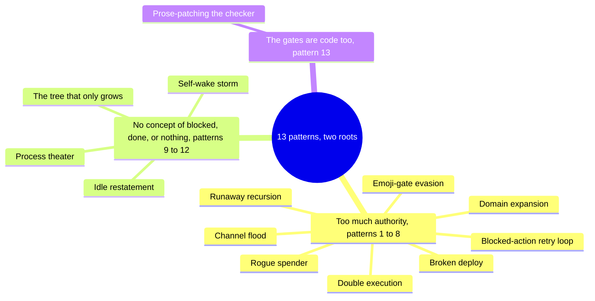
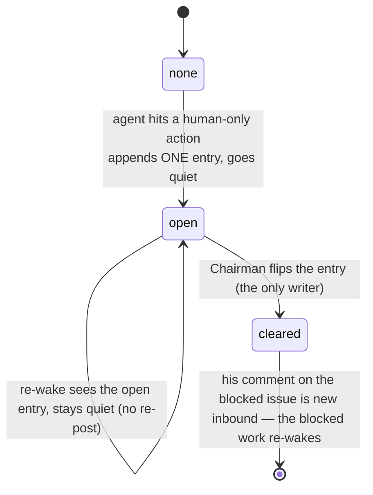
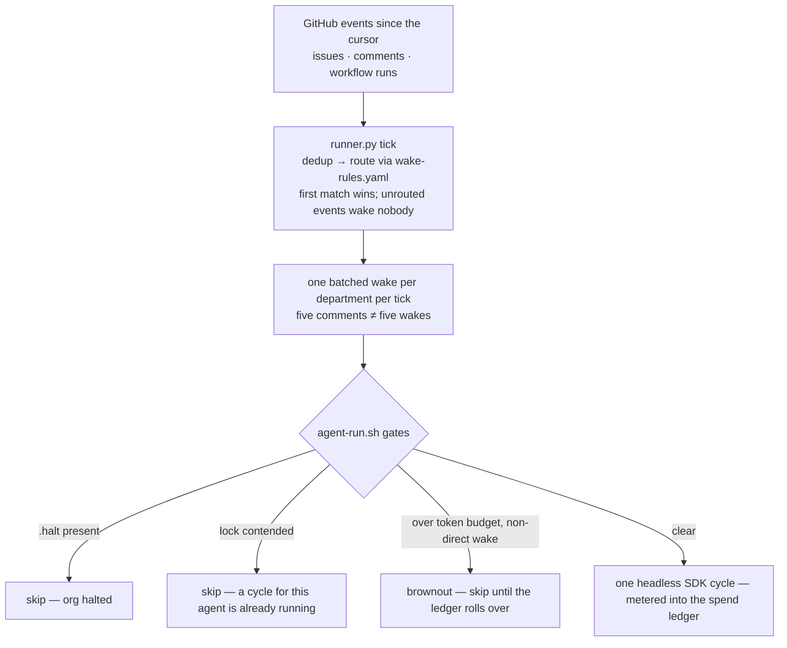
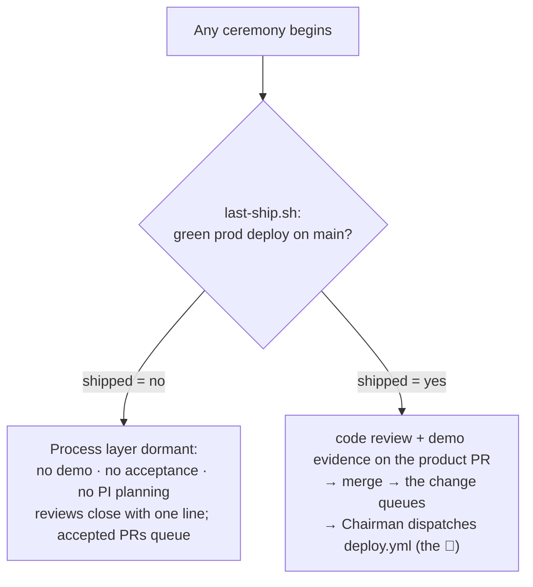
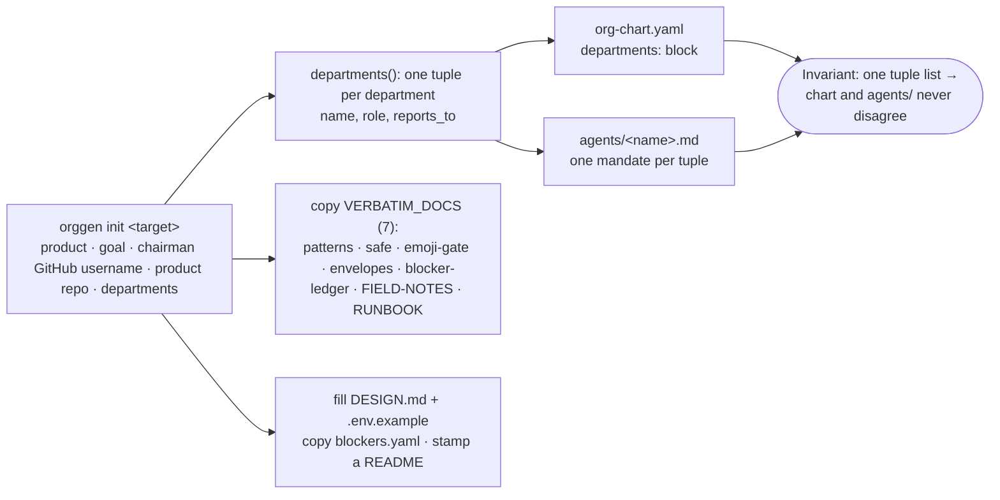
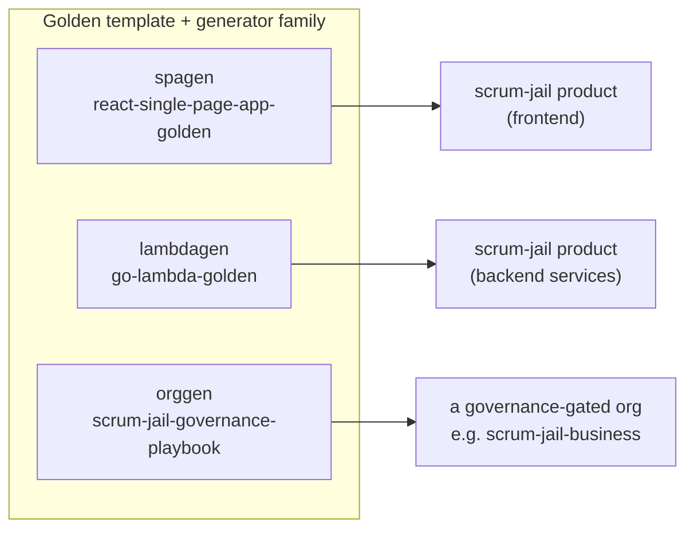

# Architecture — Scrum Jail Governance Playbook

This document explains **how the governance playbook is put together** and the mechanism it
encodes: how a fleet of autonomous LLM agents can do real work while a human stays firmly in
control. It is the architectural companion to the conceptual docs
([`emoji-gate.md`](../emoji-gate.md), [`patterns.md`](../patterns.md),
[`blocker-ledger.md`](../blocker-ledger.md), [`safe.md`](../safe.md)) and the setup walkthrough
([`RUNBOOK.md`](../RUNBOOK.md)).

> **One-line summary:** *Agents propose. The human Chairman authorizes by merging a
> `decisions.yaml` PR (money, org-shape) or manually dispatching the deploy workflow (prod).
> GitHub
> — platform configuration, never an LLM and no longer a bot — enforces.* This repo packages
> that model as copyable primitives plus a generator (`bin/orggen`) that stamps a fresh
> governance-gated org.

---

## The Scrum Jail ecosystem

This repo is one of three that together form a small, self-contained experiment in autonomous
software organizations. Each repo stands alone, but they only make full sense as a triangle:



| Repo | Role | What lives here |
|---|---|---|
| **scrum-jail-governance-playbook** *(you are here)* | **Methodology** | The governance model, the 13 misbehavior patterns + fixes, and `orggen` — packaged so anyone can copy it. |
| [scrum-jail-business](https://github.com/johnplantada/scrum-jail-business) | **Runtime** | The live multi-agent org that runs scrumjail.org. It *vendors* this repo's docs and is the org these primitives were extracted from. |
| [scrum-jail](https://github.com/johnplantada/scrum-jail) | **Product** | The actual website the org builds and ships. |

**This repo is the "golden source."** The live org (`scrum-jail-business`) pulls these docs in
as a pinned, read-only snapshot: `make sync-playbook` copies the docs and records the golden
commit it copied from, and the business repo's CI verifies the vendored copy against that
pinned commit — a mismatch **fails the build**, while a pin that merely trails the golden's
`main` produces a **warning**, not a failure (staleness is a choice; silent tampering is not).
So the patterns and gates here are not theory — they are the literal primitives a running org
dogfoods every day.

---

## What this repo is — and is not

This is a **GitHub template repo**: documentation + YAML config + one Python generator. It
contains **no runtime**. The runtime is deliberately thin — a handful of scripts wrapping the
`gh` CLI, plus GitHub platform primitives that are *configuration, not code*:

- **Scripts** (the moving parts): `runner.py` + `wake-rules.yaml` (poll GitHub, route events to
  department wakes), `agent-run.sh` + `agent_cycle.py` (one headless Claude cycle per wake),
  `pm-gh.sh` (the ticket CLI over Issues + a Project).
- **Platform** (the enforcing parts): branch protection + CODEOWNERS,
  `workflow_dispatch`-only deploy workflows, Actions CI.

The reference implementation of the scripts powers the live `scrum-jail-business` org;
[`RUNBOOK.md`](../RUNBOOK.md) ("What This Repo Ships vs. What You Build") specifies each
component's contract precisely enough to write your own thin version — none is more than a
small script.

```
scrum-jail-governance-playbook/
├── README.md            entry point + file inventory
├── RUNBOOK.md           afternoon setup, incl. ships-vs-builds + the gate-verification tests
├── emoji-gate.md        the authorization gate (historical filename; the mechanism is
│                        merges + manual deploy dispatches, not chat emoji)
├── patterns.md          13 misbehavior patterns + counter-patterns
├── blocker-ledger.md    the anti-"blocked loop" primitives
├── safe.md              scaled-agile without the theater
├── envelopes.yaml       authority-envelope field reference + presets
├── org-chart.yaml       a concrete example org (the runtime's parameter file)
├── bin/orggen           the generator — stamps a complete org from _init/ + runtime/
├── _init/               the governance templates orggen fills in
│   ├── DESIGN.md         the constitution (PRODUCT/GOAL placeholders)
│   ├── VISION.md         the one-page why + who (PRODUCT/GOAL placeholders)
│   ├── org-chart.yaml    chart template (chairman + departments)
│   ├── blockers.yaml     empty human-task ledger
│   ├── .env.example      the env contract the runtime reads
│   ├── github/           CODEOWNERS + issue forms (dropdowns stamped from the roster)
│   └── agents/           _policy.md (shared) + department.tmpl.md + role mandates
│                         (ceo.md, warden.md, compliance.md)
└── runtime/             the runtime, stamped verbatim — scripts/ (runner, pm-gh,
                         agent-run, warden, gates, tests), .claude/ (settings + skills),
                         org CI workflows, the operator Makefile, decisions.yaml seed
```

---

## The core idea — propose → approve → execute

Every privileged action (spend money, deploy to prod, charter or dissolve a department, raise a
model tier) flows through the same loop. The human is the only one who can authorize, and
authorization is an act GitHub already knows how to gate: **a merge or a manual workflow
dispatch** — something no agent can perform, because the agents' shared identity cannot merge
to a protected `main`, and its token must not carry the Actions-write right that dispatching
requires (the credential-hygiene rule in [`emoji-gate.md`](../emoji-gate.md)).

**Money and org-shape** go through the decisions ledger:



**Prod deploys** go through the product repo's dispatch-only trigger:



*(A `production` environment with a required reviewer is the approve-button variant of this
gate — use it only where your plan enforces it: on a **private** repo, required reviewers
need Team/Enterprise, and a Free-plan Settings screen accepts them without enforcing. The
live org learned this by shipping the environment first; the RUNBOOK's Test 2 exists so you
learn it in a test instead.)*

Why this works: the only authority is **platform configuration keyed to the Chairman's GitHub
account**, checked by GitHub itself — there is no bot to verify a reactor, and nothing to
evade short of the platform. One honest caveat: CODEOWNERS alone only *routes* the review;
the branch-protection rule "require review from Code Owners" is what makes it *binding*, and
that is a repo-Settings step a human must actually perform. The RUNBOOK's gate-verification
tests exist precisely to prove you flipped it. The 🛑 emergency stop is not a gate at all — it
is a `.halt` flag file that stops the runner and every agent cycle, and only a human removes
it. See [`emoji-gate.md`](../emoji-gate.md) for the full loop, the `decisions.yaml` entry
schema, and the common-mistakes table.

---

## The governance model — org chart, envelopes, gate vocabulary

Authority is declared, not improvised. `org-chart.yaml` is the runtime's source of truth for
*who exists*; each node carries an **envelope** bounding what it may do without asking.



An envelope has four fields (full reference + presets in [`envelopes.yaml`](../envelopes.yaml)):

| Field | Meaning | Hitting the limit is the *protocol*, not an error |
|---|---|---|
| `max_subagents` | how many sub-teams this node may spawn | exceed it → open a `[CHARTER]` decisions.yaml PR, wait for the merge |
| `daily_token_budget` | per-day token ceiling, metered per call into the spend ledger | enforced as a **brownout** (`budget_gate.py`): over-budget wakes skip — except direct, event-routed wakes, which always run; the org-wide daily $ cap is a separate breaker at the runner |
| `can_spend` | almost always `false` | attempt → must open a `[SPEND]` decisions.yaml PR, wait for the merge |
| `can_deploy` | almost always `false` | the deploy job runs only from a manual `workflow_dispatch` regardless — wait for the Chairman's dispatch |

The six governance gates. The emoji survive from the chat era as **mnemonic ledger
vocabulary** (`org-chart.yaml` → `governance:`) — nothing parses a reaction anymore; four of
the six are `decisions.yaml` `type` strings, and the other two are platform/file mechanisms:

| Gate | Mnemonic | Action | Mechanism |
|---|---|---|---|
| `charter` | 🏛️ | charter a new department | decisions.yaml PR (`type: charter`) → Chairman's merge |
| `sunset` | ⚰️ | sunset (dissolve) a department | decisions.yaml PR (`type: sunset`) → Chairman's merge |
| `promote` | 💎 | raise a node's model tier | decisions.yaml PR (`type: promote`) → Chairman's merge |
| `fund` | 💰 | approve spend up to a stated ceiling | decisions.yaml PR (`type: spend`) → Chairman's merge |
| `ship` | 🚀 | approve a production deploy | `workflow_dispatch`-only deploy workflow → the Chairman's manual dispatch |
| `halt` | 🛑 | emergency stop — halts the **whole org** (not a per-proposal veto) | `.halt` flag file; only a human removes it |

---

## The two failure roots — and the 13 patterns

The patterns documented here are battle scars. They cluster into two roots: agents given **too
much authority**, and an orchestration loop with **no concept of "blocked," "done," or "do
nothing."** (Pattern 13 mirrors both: a buggy gate collects compliance instead of bug reports.)



The first root is cured by the authorization gate and tight envelopes (above). The second root
is cured by a few smaller primitives, described next. Full write-ups in
[`patterns.md`](../patterns.md).

---

## Stopping the "blocked loop"

A naive agent loop, when it hits something only a human can do, re-states the blocker forever and
burns tokens. Three primitives (see [`blocker-ledger.md`](../blocker-ledger.md)) fix this.

**1 — The capability boundary.** A hard list of things *no* agent can ever do: hold credentials,
move money, register a domain, or perform the governance merges and deploy dispatches.
These are the human's alone.

**2 — The blocker ledger.** `blockers.yaml` is a durable operator queue. When an agent hits a
human-only action it appends **one** entry and goes quiet — it never re-posts. Only the Chairman
clears an entry; his follow-up on the blocked issue is the GitHub event that wakes the owner.



**3 — Event-driven wakes.** The old architecture needed backpressure — classifiers and no-op
gates to make idle wakes cheap. The new one makes them **nonexistent**: there are no scheduled
wake floors and no broadcast fan-out. The runner polls GitHub each tick and wakes a department
only when a routed event names it. No event, no wake, no spend — zero-cost idleness is
structural, not clever.



One reliability note, stated honestly: delivery is currently **at-most-once**. The runner's
cursor advances per tick even if a dispatched cycle crashes; the abort is logged loudly, but
the triggering events are not re-delivered — re-delivery on failure is an open follow-up in
the live runtime, not a property you can rely on. (The chat-era loop claimed at-least-once;
that guarantee did not survive the rewrite yet.)

---

## Scaled-agile without the theater

Ceremony (demos, reviews, planning) is gated on **shipped output, not elapsed time**. A single
predicate — `last-ship.sh`, "is there a green `deploy.yml` run on the product's `main`?" —
decides whether the whole process layer is awake. Full rules in [`safe.md`](../safe.md).



This is why capabilities can ship **dormant** behind a charter: until the org actually ships
something, no one runs a planning meeting about it. The PI counters are GitHub-native too —
iteration and PI boundaries are derived from closed `[REVIEW]` issues, not from a bus that no
longer exists.

Two gates sit in front of any product-surface deploy (see [`safe.md`](../safe.md) /
[`emoji-gate.md`](../emoji-gate.md)): an independent **code review** proves the code is
*correct* — in the live org the chat-era Reviewer department retired with the demolition, and
review returns as a `claude-code-action` check on product PRs when needed — and **demo
evidence** on the PR (checked mechanically, head-SHA-bound) proves the change *reaches a user*.
Only then does the change earn the Chairman's dispatch.

---

## `orggen` — the generator

`bin/orggen` is a dependency-free Python 3 script that stamps a fresh, governance-gated org repo
from `_init/`. Its load-bearing trick: a single list of department tuples drives **both** the
`org-chart.yaml` and the per-department `agents/*.md` mandates, so the chart and the agent files
can never disagree about who exists.



Usage (the chairman identifier is your **GitHub username** — CODEOWNERS keys off it, and the
deploy dispatch is yours to click; there are no bot ids and no channels to
configure):

```bash
bin/orggen init ../my-org --product "myproduct.com" --goal "$10k/month" \
  --chairman-github <your-github-username> --product-repo <you>/<product-repo> \
  --departments ceo,business,it
```

`ceo` is special-cased (reports to the board, `max_subagents: 0`); every other name reports to
the CEO with an envelope of `4 / 500k`. The seven governance docs are copied **verbatim** (they
are meant to travel unchanged); `DESIGN.md`, `.env.example` (the org/product repo slugs the
runner and `pm-gh.sh` read), and the org chart are filled from your flags. The generator stamps
the governance + behavioral layer only — it prints, as its first next step, how to bring the
thin runtime in, per the contracts in [`RUNBOOK.md`](../RUNBOOK.md).

---

## Where this sits in the generator family

`orggen` is the org-governance sibling of two code generators used to build the actual product:



Same philosophy — *the pattern lives in a golden repo, and a generator copies + parameterizes it*
— applied to organizational governance instead of code.

---

## v1 — the chat era (retired 2026-07-05)

The first version of this architecture ran on chat: Mattermost as the medium, five Go services
(bus, pm, registrar, memory, vox) as the runtime, a fleet of watcher scripts for wakes, and a
governance gate that was literally an emoji — the Registrar parsed `reaction_added` events off
a WebSocket and verified the reactor's user id in code. It worked, and every pattern in
[`patterns.md`](../patterns.md) was earned there. But the properties it was chasing —
coordination, visibility, auditability, decision authority — are *system-of-record* properties,
and the chat org implemented them by parsing a system of *conversation*: prose-policed
conventions, plus a bot to verify what the platform could have enforced. On 2026-07-05 the live
org demolished the whole stack in one move (no parallel run) and put the record where the
output lives: GitHub Issues, PRs, Actions runs, and committed ledgers, enforced by GitHub
itself. The emoji survive only as ledger vocabulary. The before-measurements live in the
business repo's `docs/MIGRATION-BASELINE.md`; the code lives in git history, which is where
retired architecture belongs.

---

## Provenance

Everything here was extracted from the live org running [scrumjail.org](https://scrumjail.org).
The `org-chart.yaml`, `DESIGN.md`, and `agents/*.md` are the real primitives that org uses,
generalized with placeholders and packaged so you can copy, fill in, and run them. The arrows in
the [ecosystem diagram](#the-scrum-jail-ecosystem) are not aspirational — they describe a system
that runs today.
