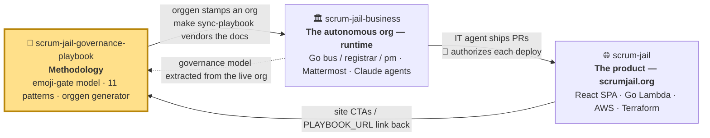
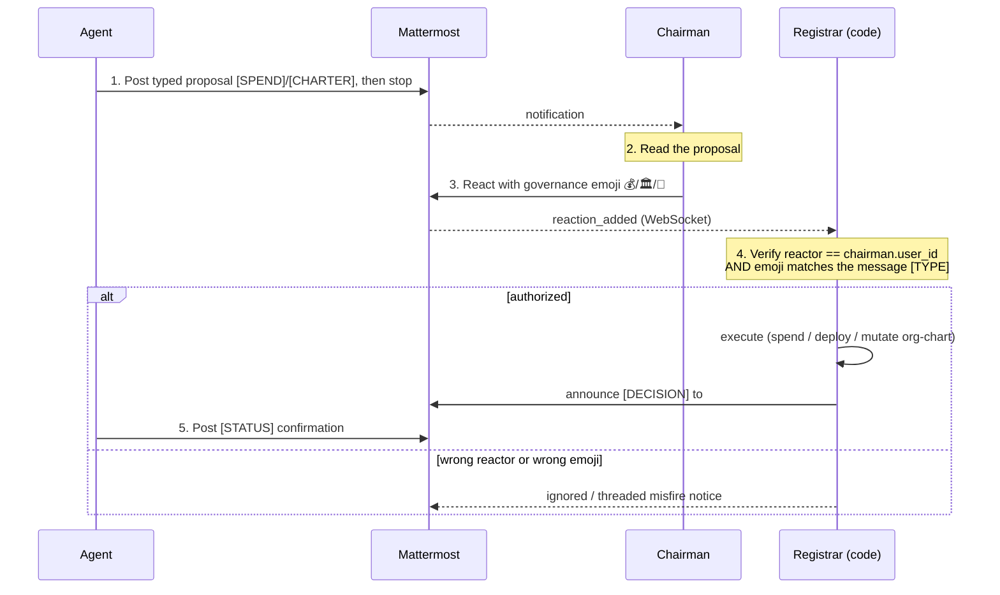
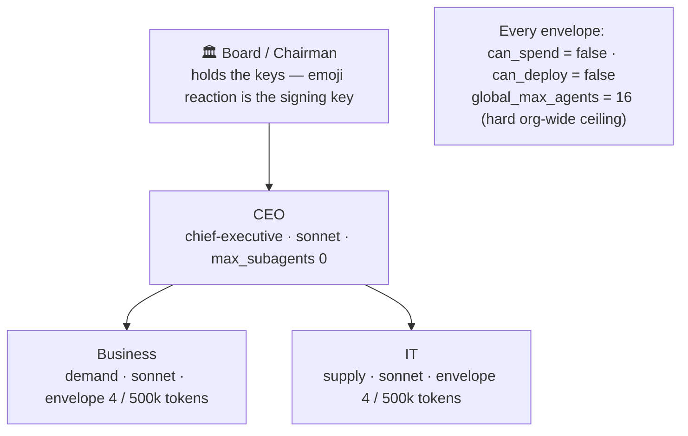
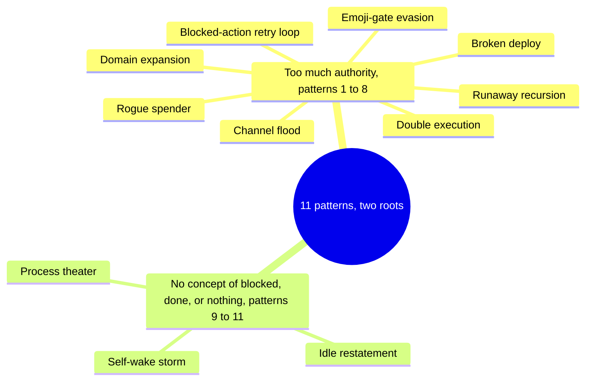
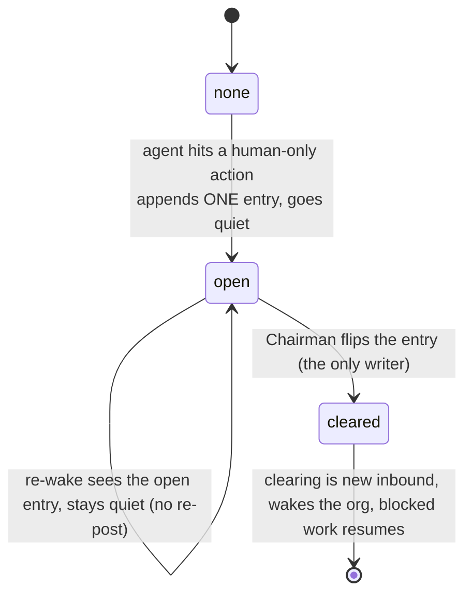
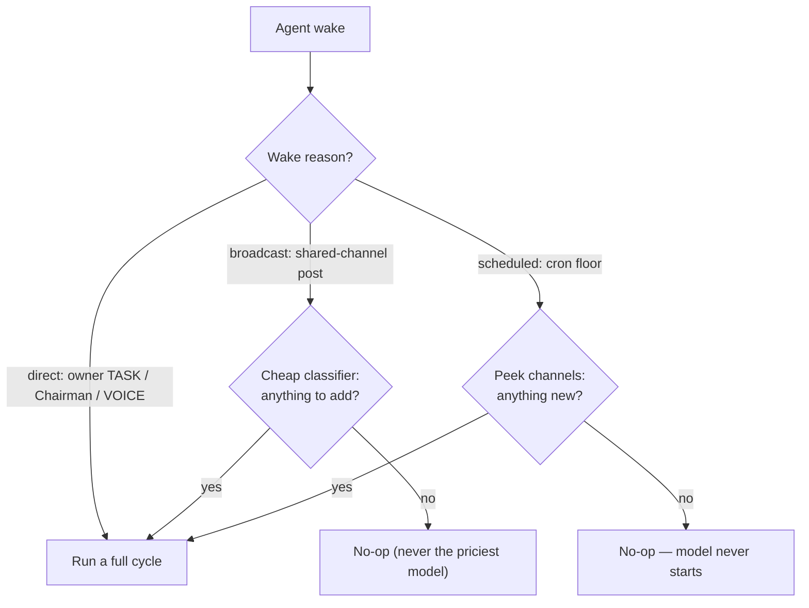
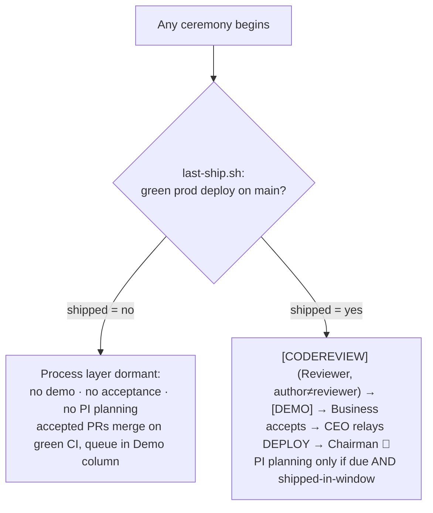
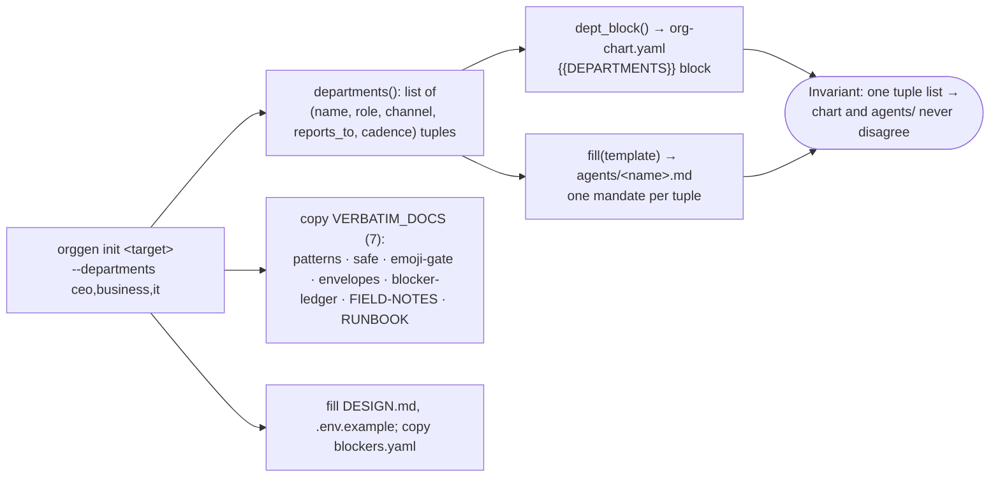
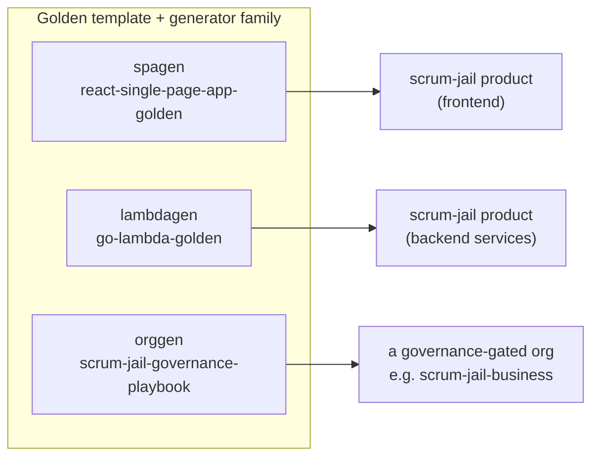

# Architecture — Scrum Jail Governance Playbook

This document explains **how the governance playbook is put together** and the mechanism it
encodes: how a fleet of autonomous LLM agents can do real work while a human stays firmly in
control. It is the architectural companion to the conceptual docs
([`emoji-gate.md`](../emoji-gate.md), [`patterns.md`](../patterns.md),
[`blocker-ledger.md`](../blocker-ledger.md), [`safe.md`](../safe.md)) and the setup walkthrough
([`RUNBOOK.md`](../RUNBOOK.md)).

> **One-line summary:** *Agents propose. The human Chairman approves with a rare emoji. A
> deterministic Registrar — code, never an LLM — executes.* This repo packages that model as
> copyable primitives plus a generator (`bin/orggen`) that stamps a fresh governance-gated org.

---

## The Scrum Jail ecosystem

This repo is one of three that together form a small, self-contained experiment in autonomous
software organizations. Each repo stands alone, but they only make full sense as a triangle:



| Repo | Role | What lives here |
|---|---|---|
| **scrum-jail-governance-playbook** *(you are here)* | **Methodology** | The governance model, the 11 misbehavior patterns + fixes, and `orggen` — packaged so anyone can copy it. |
| [scrum-jail-business](https://github.com/johnplantada/scrum-jail-business) | **Runtime** | The live multi-agent org that runs scrumjail.org. It *vendors* this repo's docs and is the org these primitives were extracted from. |
| [scrum-jail](https://github.com/johnplantada/scrum-jail) | **Product** | The actual website the org builds and ships. |

**This repo is the "golden source."** The live org (`scrum-jail-business`) pulls these docs in
as a pinned, read-only snapshot (`make sync-playbook`, drift-checked in CI). So the patterns and
gates here are not theory — they are the literal primitives a running org dogfoods every day.

---

## What this repo is — and is not

This is a **GitHub template repo**: documentation + YAML config + one Python generator. It
contains **no runtime**. The Go services that actually watch Mattermost and enforce the gate
(the *Registrar*, the *bus*, the *pm* CLI) live in the separate `scrum-jail-business` repo. When
you `orggen init` a new org, the generator prints the next step: copy that Go runtime in.

```
scrum-jail-governance-playbook/
├── README.md            entry point + file inventory
├── RUNBOOK.md           afternoon setup, incl. the 3 gate-verification tests
├── emoji-gate.md        the core safety primitive (5-step loop)
├── patterns.md          11 misbehavior patterns + counter-patterns
├── blocker-ledger.md    the anti-"blocked loop" primitives
├── safe.md              scaled-agile without the theater
├── envelopes.yaml       authority-envelope field reference + presets
├── org-chart.yaml       a concrete example org (the Registrar's source of truth)
├── bin/orggen           the generator — stamps a new org from _init/
└── _init/               the template orggen fills in
    ├── DESIGN.md         the constitution (PRODUCT/GOAL placeholders)
    ├── org-chart.yaml    chart template ({{CHAIRMAN_ID}}, {{DEPARTMENTS}})
    ├── blockers.yaml     empty human-task ledger
    ├── .env.example      secrets/config template
    └── agents/           _policy.md (shared) + department.tmpl.md
```

---

## The core idea — propose → approve → execute

Every privileged action (spend money, deploy to prod, charter or dissolve a department, raise a
model tier) flows through the same five steps. The human is the only one who can authorize, and
authorization is a **rare emoji reaction** — something a casual 👍 can never trigger.



Why this works: the only authority is `chairman.user_id`, checked in code. An agent that reacts
with the same emoji does **nothing**. The Registrar holds no spend or deploy credentials itself —
for money and prod it merely *records* the Board's approval; the actual spend/deploy happens
downstream within the approved ceiling. See [`emoji-gate.md`](../emoji-gate.md) for the message
templates and the common-mistakes table.

---

## The governance model — org chart, envelopes, emoji

Authority is declared, not improvised. `org-chart.yaml` is the Registrar's source of truth for
*who exists*; each node carries an **envelope** bounding what it may do without asking.



An envelope has four fields (full reference + presets in [`envelopes.yaml`](../envelopes.yaml)):

| Field | Meaning | Hitting the limit is the *protocol*, not an error |
|---|---|---|
| `max_subagents` | how many sub-teams this node may spawn | exceed it → post a `[CHARTER]` to the Board, wait for 🏛️ |
| `daily_token_budget` | declared per-day token target — *not* code-enforced (see [`envelopes.yaml`](../envelopes.yaml)) | audited against the spend ledger; cost is actually bounded by wake backpressure + tier-pinning |
| `can_spend` | almost always `false` | attempt → must post `[SPEND]`, wait for 💰 |
| `can_deploy` | almost always `false` | attempt → must post `[DEPLOY]`, wait for 🚀 |

The six governance emoji and the `[TYPE]` each may act on:

| Emoji | Name | Action | Acts on |
|---|---|---|---|
| 🏛️ | `classical_building` | charter a new department | `[CHARTER]` |
| ⚰️ | `coffin` | sunset (dissolve) a department | `[SUNSET]` |
| 💎 | `gem` | promote a node's model tier | `[PROMOTE]` |
| 💰 | `moneybag` | fund (record spend approval) | `[SPEND]` |
| 🚀 | `rocket` | ship (record deploy approval) | `[DEPLOY]` |
| 🛑 | `octagonal_sign` | emergency stop — halts the **whole org** (not a per-proposal veto) | *any* message |

---

## The two failure roots — and the 11 patterns

The patterns documented here are battle scars. They cluster into two roots: agents given **too
much authority**, and an orchestration loop with **no concept of "blocked," "done," or "do
nothing."**



The first root is cured by the emoji gate and tight envelopes (above). The second root is cured by
three smaller primitives, described next. Full write-ups in [`patterns.md`](../patterns.md).

---

## Stopping the "blocked loop"

A naive agent loop, when it hits something only a human can do, re-states the blocker forever and
burns tokens. Three primitives (see [`blocker-ledger.md`](../blocker-ledger.md)) fix this.

**1 — The capability boundary.** A hard list of things *no* agent can ever do: hold credentials,
move money, register a domain, or perform the governance reactions. These are the human's alone.

**2 — The blocker ledger.** `blockers.yaml` is a durable operator queue. When an agent hits a
human-only action it appends **one** entry and goes quiet — it never re-posts. Only the Chairman
clears an entry, and that clearing is itself new inbound that wakes the org.



**3 — Wake backpressure.** Wakes are classified by *reason*, and a wake with nothing to do costs
zero tokens because the model never starts.



Two reliability corollaries: suppressed wakes **coalesce** into one delayed retry rather than
dropping, and a read cursor only advances after a **successful** cycle (at-least-once delivery).

---

## Scaled-agile without the theater

Ceremony (demos, reviews, planning) is gated on **shipped output, not elapsed time**. A single
predicate — `last-ship.sh`, "is there a green prod deploy on `main`?" — decides whether the whole
process layer is awake. Full rules in [`safe.md`](../safe.md).



This is why the capabilities can ship **dormant** behind a 🏛️ charter: until the org actually
ships something, no one runs a planning meeting about it.

Two gates sit in front of any product-surface deploy (see [`safe.md`](../safe.md) /
[`emoji-gate.md`](../emoji-gate.md)): a **`[CODEREVIEW]`** from an independent **Reviewer**
department — structurally separate from whoever wrote the code (**author ≠ reviewer**),
head-SHA-bound, and dormant until a `reviewer` is chartered — proves the code is *correct*, and
the **`[DEMO]`** proves it *reaches a user*. Only an accepted demo (citing its passing review)
earns the 🚀.

---

## `orggen` — the generator

`bin/orggen` is a dependency-free Python 3 script that stamps a fresh, governance-gated org repo
from `_init/`. Its load-bearing trick: a single list of department tuples drives **both** the
`org-chart.yaml` and the per-department `agents/*.md` mandates, so the chart and the agent files
can never disagree about who exists.



Usage:

```bash
bin/orggen init ../my-org --product "myproduct.com" --goal "$10k/month" \
  --chairman-id <YOUR_MATTERMOST_USER_ID> --departments ceo,business,it
```

`ceo` is special-cased to `(ceo, chief-executive, board, board, weekly)` with `max_subagents: 0`;
every other name maps to `(name, name, name, ceo, daily)` with an envelope of `4 / 500k`. The seven
governance docs are copied **verbatim** (they are meant to travel unchanged); `DESIGN.md`,
`.env.example`, and the org chart are filled from your flags.

---

## Where this sits in the generator family

`orggen` is the org-governance sibling of two code generators used to build the actual product:



Same philosophy — *the pattern lives in a golden repo, and a generator copies + parameterizes it*
— applied to organizational governance instead of code.

---

## Provenance

Everything here was extracted from the live org running [scrumjail.org](https://scrumjail.org).
The `org-chart.yaml`, `DESIGN.md`, and `agents/*.md` are the real primitives that org uses,
generalized with placeholders and packaged so you can copy, fill in, and run them. The arrows in
the [ecosystem diagram](#the-scrum-jail-ecosystem) are not aspirational — they describe a system
that runs today.
